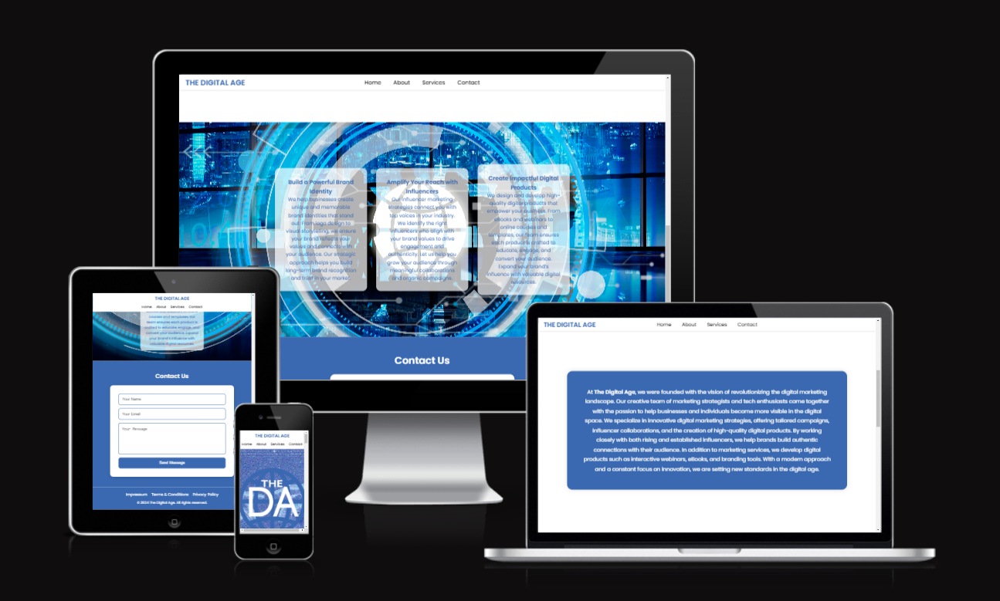
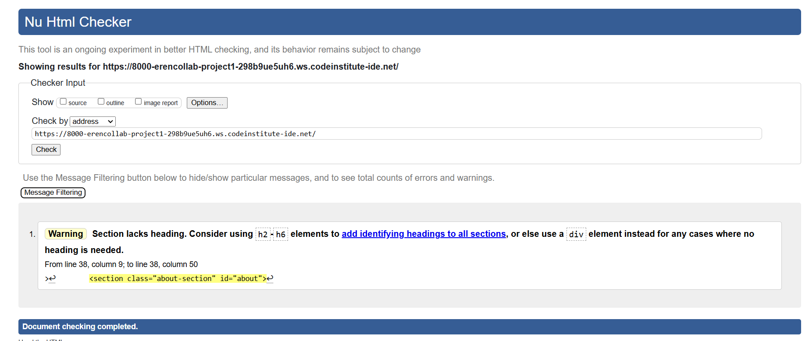
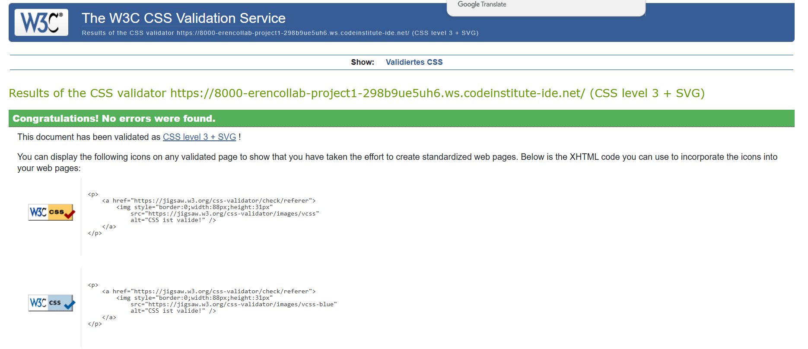

# The Digital Age

The Digital Age is a modern and responsive website designed to showcase a digital marketing agency's services. It includes sections for branding, influencer marketing, and digital product creation, with a professional and clean design. The website is fully responsive and works on all screen sizes, from desktops to mobile devices.

## Features

### Navigation
- A fixed navigation bar at the top of the page that includes links to `Home`, `About`, `Services`, and `Contact`.
- The navbar adjusts on smaller screens for better usability.

### Header
- The header includes the company logo and a fullscreen background image.
- The navbar becomes sticky when scrolling down.

### Services Section
- This section showcases the three core services: Branding, Influencer Marketing, and Digital Products.
- Each service has its own card with a hover effect that reduces transparency.

### Contact Section
- The contact section includes a contact form with fields for name, email, and message.
- The form includes validation for required fields and proper email formatting.

### Footer
- The footer contains links to the `Impressum`, `Terms & Conditions`, and `Privacy Policy` pages.

## Screenshots
### Responsive Design (All Devices)

### HTML Validator Test

### CSS Validator Test

## Testing
- The website was tested on major browsers: Chrome, Firefox, and Safari.
- Mobile responsiveness was verified using Chrome's developer tools.
- The contact form was tested for proper validation and error messages.

## Validator Testing
- **HTML:** Passed W3C validation with no errors, except for a **Warning** stating: 
  - *"Section lacks heading. Consider using h2-h6 elements to add identifying headings to all sections, or use a div element where no heading is needed."* 
- **CSS:** Passed the official CSS validator with no errors.  
- **Accessibility:** Verified using Lighthouse with high scores for contrast and readability.

## Bugs and Fixes
- No unresolved bugs were found during testing.
- Fixed a minor issue with the footer positioning on smaller screens.

## Deployment
The website was deployed using GitHub Pages. Steps to deploy:
1. Push all project files to the `main` branch.
2. Go to the repository settings on GitHub.
3. Enable GitHub Pages under the `Pages` section and select the `main` branch.
4. The site will be live at the provided GitHub Pages link.

## Credits
- The background image was sourced from [Pexels](https://www.pexels.com).
- Code for social media icons was adapted from the CI Learning Project.

## Media
- All images and icons used are licensed for free commercial use.
